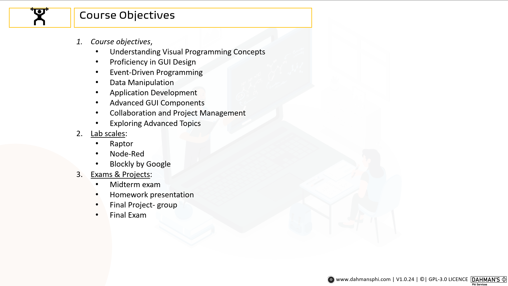

> [!IMPORTANT] 
> Ensure that the course content aligns with the proposed plan outlined below.

> [!NOTE]
> 1. To view the *objectives* please visit [Course objectives](#course-objectives).
> 2. To view the *contents* please visit [Course contents](#course-contents).
> 3. To view the lab code please visit [lab folder](/lab/).

# Course Objectives

# Course Contents

